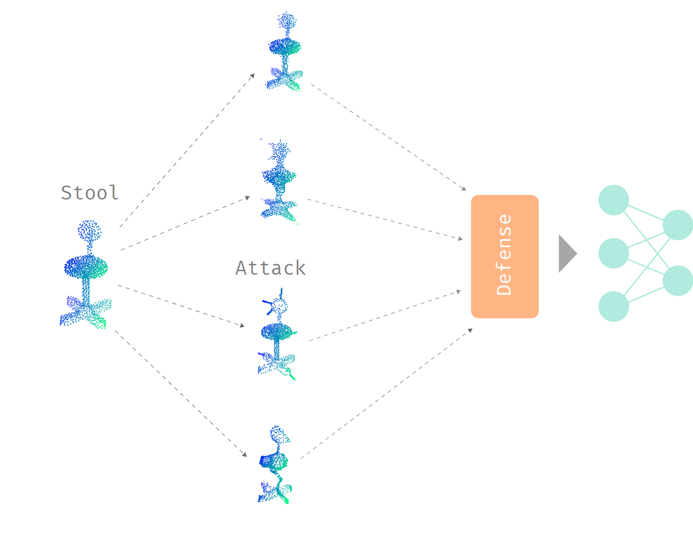

# Adversarial point perturbations on 3D objects
New distributional and shape attacks on neural networks that process 3D point cloud data. Preprint paper: **[here](https://arxiv.org/abs/1908.06062)**. The paper has been accepted to the 2020 ECCV Workshop on Adversarial Robustness in the Real World. If you use this code, please cite

```
@article{liu2019adversarial,
  title={Adversarial point perturbations on 3D objects},
  author={Liu, Daniel and Yu, Ronald and Su, Hao},
  journal={arXiv preprint arXiv:1908.06062},
  year={2019}
}
```

An alternative version of the code with better Jupyter support is available [here](https://github.com/TangeniThePyGuru/Adversarial-point-perturbations-on-3D-objects), which is separately maintained by [Tangeni M. Shikomba](https://github.com/TangeniThePyGuru).



Currently, it is quite easy to generate effective adversarial attacks, in both 2D and 3D. The goal in this work is to generate adversarial examples that uses shape information intrinsic to 3D point sets. Four attacks are proposed:

- The **distributional attack** that perturbs points on or very near the surface of a 3D object. The surface for a point cloud is approximated by using the alpha shape triangulation algorithm on the points, and projected gradient descent to move points on or near the shape. This is sped up by building a VP-tree.
- The **perturbation resampling** attack that does standard gradient descent to attack, but then estimates the shape through triangulation and resamples points on the estimated shape. This ensures that the points are distributed on the surface of the 3D object with uniform density.
- The **adversarial sticks** attack that creates a few sticks connected to the shape of a point cloud, which is once again estimated through triangulation. The aim of this attack was the ease of construction in real-life. Adversarial examples are generated through gradient descent to approximate effective stick orientations by perturbing a few points, and resampling points onto the sticks.
- The **adversarial sinks** attack that pulls points towards sinks (kind of like black holes) to perturb the shape. The strength of the pull falls off over distance. Adversarial examples are generated using first-order methods like Adam.

The last three methods are effective against point removal defenses, like outlier and salient point removal, and they are generally easier to construct in real-life.

# Setup
Initially, part of the code for training/testing neural networks was designed to be ran on a server with GPUs, and the other part for visualizing results was supposed to be ran on a personal computer. The setup instructions below are for running both parts on the same computer.

You need Python 2.7 with TensorFlow 1.4, Matplotlib, Numpy, Numba, and Scipy.

This is the final directory structure of the project:
```
/
    pointnet/
    pointnet2/
    dgcnn/
    Adversarial-point-perturbations-on-3D-objects/
        pointnet/
        pointnet2/
        dgcnn/
        src/
        data/
        output_save/
        figures/
```
We will assume that an empty folder is created somewhere, and we will refer to it as the root folder, or `/`. All paths from here on are relative to the root folder.

The first step is to clone three different repositories into the root folder: [PointNet](https://github.com/charlesq34/pointnet), [PointNet++](https://github.com/charlesq34/pointnet2), [DGCNN](https://github.com/WangYueFt/dgcnn), and this repo.

Then, copy the modified PointNet files from the `/Adversarial-point-perturbations-on-3D-objects/pointnet/` directory to the cloned PointNet repo `/pointnet/`, and do the same for PointNet++ and DGCNN. The modified files contain some bug fixes and other nonessential modifications that carried over from my previous [code](https://github.com/Daniel-Liu-c0deb0t/3D-Neural-Network-Adversarial-Attacks). Other than fixing a batch norm bug for PointNet and DGCNN, the other changes in the modified PointNet/PointNet++ files should not be necessary for this project, but I included all changes just in case. Note that PointNet++ needs some compiled C++ code for its operations. Read the directions given in the repo and modify the bash scripts for TensorFlow 1.4.

Follow the instructions for training PointNet, PointNet++, and DGCNN from their respective repos. A lowered batch size of 10 was used in single-GPU training for PointNet++, for lower memory requirements. The checkpoint files should be saved in `/pointnet/log/`, `/pointnet2/log/`, and `/dgcnn/tensorflow/log/` for PointNet, PointNet++, and DGCNN.

Next, assuming that the current working directory is `/`, do the following:
```
cd Adversarial-point-perturbations-on-3D-objects/
mkdir output_save/
mkdir figures/
```
For each experiment, a file with the adversarial examples, clean examples, and other stuff will be saved in the `output_save` folder. The `figures` folder is for saving generated visualizations, if necessary.

To download the necessary 3D point clouds sampled from the [ModelNet40](https://modelnet.cs.princeton.edu/) dataset, do
```
cd data/
wget https://github.com/Daniel-Liu-c0deb0t/Adversarial-point-perturbations-on-3D-objects/releases/download/Data/point_clouds.hdf5
cd ..
```
The triangle each point was sampled from are included in the HDF5 file.

In this project, there are two types of runnable scripts in the `src` folder: visualization scripts and experiment scripts.

Experiment scripts:
- `run_adversarial_examples.py` (**Do not use, very outdated!**)
- `run_old_adversarial_examples.py`

Visualization scripts:
- `example_alpha_shape.py`
- `example_perturb_proj_tree.py`
- `example_projection.py`
- `visualize_array_attack_object.py`
- `visualize_array_object_attack.py`
- `visualize_perturbed_point_cloud.py`

Experiment scripts need to be launched from the root directory:
```
cd /
python -u Adversarial-point-perturbations-on-3D-objects/src/run_old_adversarial_examples.py
```

Visualization scripts need to be launched from the `src` directory:
```
cd /Adversarial-point-perturbations-on-3D-objects/src/
python -u example_projection.py
```
Visualization scripts show a Matplotlib window.

Adjusting parameters is mainly accomplished by editing the hardcoded values in the file that is ran. These hardcoded values should appear in the first few lines of the file. For running visualization scripts prefixed with `visualize_`, you need to edit it and replace the existing paths with files that you obtained from running the experiment scripts. To run the experiments reported in the paper with default settings, directly run
```
cd /
python -u Adversarial-point-perturbations-on-3D-objects/src/run_old_adversarial_examples.py
```
The `run_old_adversarial_examples.py` script automatically goes through the attacks and defenses on PointNet. When adjusting parameters, note that the names of some parameters do not match the variables used in the paper, but the parameters' default values are the same as those reported in the paper. Each unique combination of network, attack, and defense generates a unique file in the `output_size` folder that contains saved clean/adversarial examples. All statistics are printed to stdout. Running all experiments may take a **long** time. Comment out the blocks starting with `if defense_name == "none":` will drastically speed up the process. This is because computing the Hausdorff distance with the true shape (triangular mesh) is very slow. This commented out by default.

**Implementation notes:** Perturbation resampling's alpha shape triangulation algorithm does not produce the best meshes. Another algorithm should be used for future work. Additionally, there are a few differences between the notations used in the paper and in the code. For example, compared to the paper, lambda and alpha are swapped in the code, and sigma stands for the maximum number of resampled points instead of the number of adversarial sticks.
